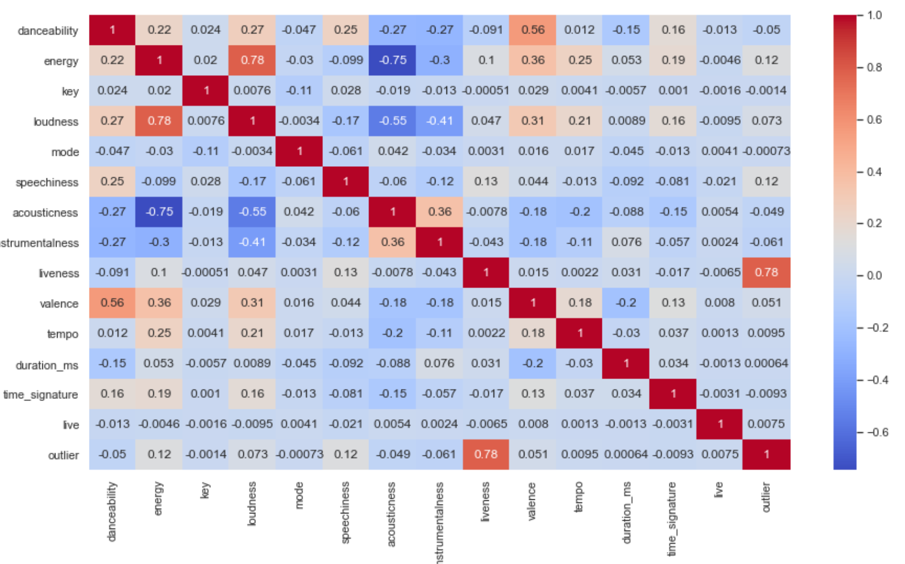
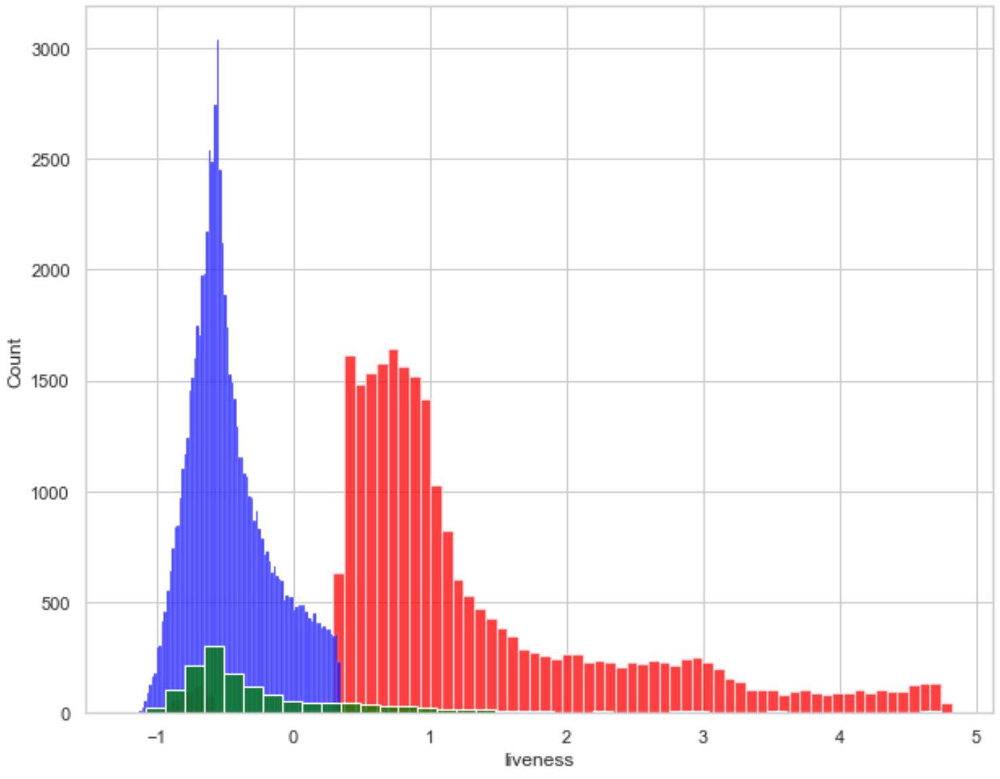
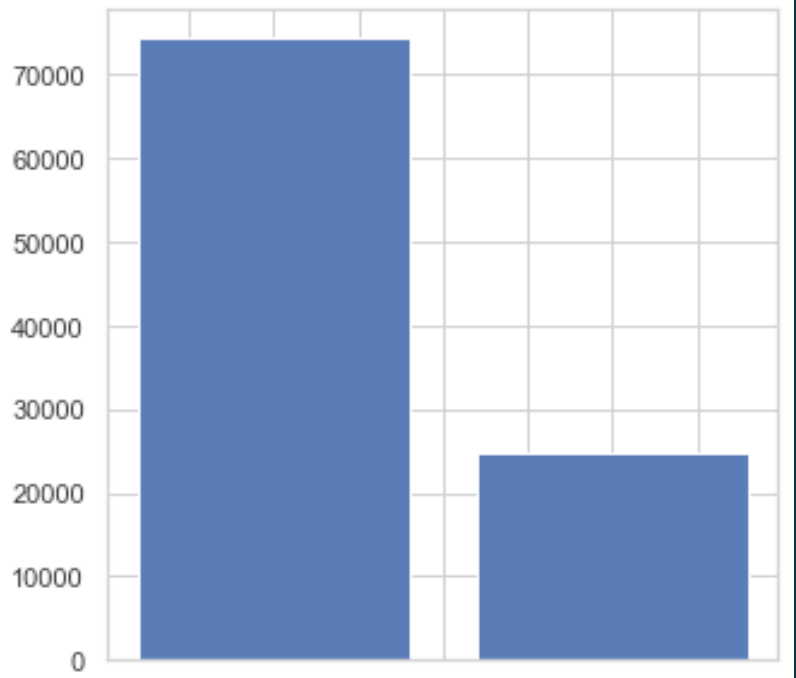
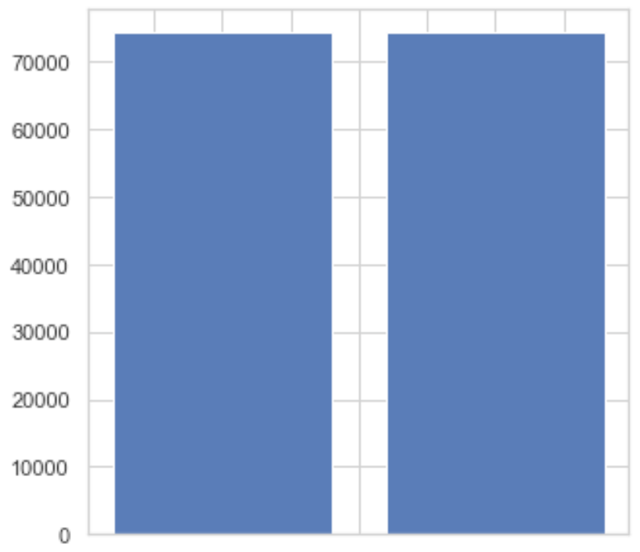

This is a project for detecting outliers which has non live music with high liveness score or has live music with low liveness score.

# 1. Introduction

A live music detector allows us to distinguish between live music and non-live music. This live music detector find the live music based on "Liveness score", which measure the presence of an audience in the recording. To accurately detect live music, it is particularly important to detect outliers which is non-live music with high liveness score and live music with low liveness score. Therefore, this project focused on how to detect outliers. 
This report will cover data preprocessing & preparation, model, result, and discussion. Firstly, the data preprocessing & preparation part will show how data was processed for model and how outliers were labelled. Secondly, model part will examine what model was used. Lastly, the results will be shown.

# 2. Data Preparation and Data Preprocessing
## 2.1. Data preparation.
Data file task100k.csv is provided. The task100k.csv file is a audio list that contains track ids, names, artists, duration, popularity, release_date, tempo, key, and liveness. However, except for liveness, there is no audio features data that help detect outliers. Therefore, audio feature data should be obtained for live music outlier detection.
### 2.1.1. Audio Feature data

To take the audio features, this project used Spotify API which provides various audio features such as danceability and energy. the audio feature data were downloaded based on track id by using Spotify API functions(audio_feature() and tracks()). In Python, these audio feature data is handled by Pandas Library.

```python
spotipy.Spotify(client_credentials_manager=SpotifyClientCredentials())
audio_feat = sp.audio_features(track_ids[start:end])
```


Before analysing data, the numeric data should be normalised by linear transformation in order to use unified scales among audio features. In this project, standardisation was used as follows:

$z =$ ${x-\mu}\over{\sigma}$,

where $\mu$ is mean and $\sigma$ is standard deviation. After standardisation, the correlation scores among audio features were displayed as illustrated by the below figure.

<figure>
    <figcaption align="center">Heatmap: correlation scores of audio features </figcaption>
    
</figure>

In the liveness, there are weak correlations with energy(0.1) and speechiness(0.13), while the others don't has relationships with liveness. the "Energy" feature represents a measure of intensity and activity including fast, loud, and noisy. It seems that live performance recoding is similar. In addition, the speechiness represents the presence of spoken words in the audio. It also seems that characteristic of liveness is close. Even though there are weak relationships with them, this project ustilsed these features for detection of outliers.

### 2.1.2. Labelling Outliers
labelled data should be necessary to train model about which one has outliers' characteristics, and the label should be 0 or 1 because the computer cand understand it. Therefore, as mentioned in the introduction, the live music outlier was defined as follows:

- outliers are non-live music with high liveness score(above 3rd quartile)
- outliers are live music with low liveness score(below 1st quartile)

This means that live music should be labelled because ourliers are decided on the basis of the live music or non-live music. This live music labelling can be carried out manually, But there are a lot of audio lists. Hence, labelling live music is performed by using the name of audio according to the following criteria

- If the name of audio includes "- live", "(live)", "[live]", and "/ live", the audio is considered as live music.
- If the name of audio includes only "live", this audio is not live music. For example, the name of audio is "Real **Live** Girl" or "Nothing Was De**live**red"

This live music labelling was carried out with the following regular expression.
```python
tokens = re.findall(r'([-/] [Ll]ive|\([Ll]ive\))', str)
``` 
If the audio is live music, the live label is 1(otherwise 0). Therefore, the outliers were labelled if the audio is live music with less than 1st quartile. the audio were considered as outliers if the audio is non-live music with high than 3rd Quartile. quartile values and histogram of ouliers and live music are shown as follows.

| Quartile of Liveness | Value |
| ----------------- | ----------- |
| 1st Quartile | -0.618 |
| 2nd Quartile(median) | -0.395 |
| 3rd Quartile | -0.336 |

<figure>
    <figcaption align="center"> Histogram of outliers and live music </figcaption>
    
    <figcaption align="center"> Blue: non-outliers, Red: outliers, Green: live music</figcaption>
</figure>

As a result, the number of outliers is 24,747 samples out of 100,000 samples.

## 2.2. Data preprocessing
As mentioned above, the dataset is imbalanced because of a shortage of the outlier samples. In this project, oversampling technique was applied to the dataset by using SMOTE library. Oversampling is randomly duplicate samples in the minority class(outlier class). 

Imbalanced dataset             |  balanced dataset(after Oversampling)
:-------------------------:|:-------------------------:
  |  
Left: non outliers Right: outliers| Left: non outliers Right: outliers

# 3. Model (XGBoost)
## 3.1. Model
In this project, this problem is considered as classification based on outlier labels. XGBoost algorithm was used for predicting the outlier class. Boosting is an ensemble algorithm with a sequential process. The gradient boosting is an approach where new models are trained to predict the residual(error = true - pridiction) of prior models. 

Detail gradient boosting algorithm is presented as follows:
1. initial prediction 
2. Calculation of Similarity Score.
    Similarity Score = $\frac{\text{(Sum of Residuals})^2}{\text{Number of Residuals} + \lambda}$

3. Calculation of gain
    Gain = sum leaf similarity score - root similarity score
    
4. Choose a branch with largest gain score.
5. Regularisation and Prune branchs.
6. Prediction sum (learning rate x prediction(each tree))

## 3.2. Optimisation


Through gridsearchCV, the best parameters were selected for better performance. 

| Parameter | Value |
| ----------------- | ----------- |
| gamma | 0.25 |
| learning_rate | 0.1 |
| max_depth | 5 |
| reg_lambda | 0 |

## 3.3. Result
please refer to model_master.ipynb file.

## 5.1. Model
### 5.1.1. convolution neural network
As mentioned above, the model is a convolution neural network(CNN) with a fully connected neural network(FCNN). The convolution neural network uses a convolutional product between image pixels and kernel(filter) values, and the model assigns importance(learnable weights and biases). This network can take an image as input data that contains spatial information. In addition, shared weights in each kernel are used for reducing the number of parameters compared with a fully connected neural network. For predicting a class, the fully connected neural network was used after computing CNNs.

### 5.1.2. detial model architecture
This model adopted 3 layers of convolution neural networks(CNN) and 2 layers of fully connected neural networks(FCNN). The detail layer information is presented as follows:

<figure>
    <figcaption align="center"> Model Summary </figcaption>
    
    <!-- <figcaption align="center"> </figcaption> -->
</figure>


## 5.2. Result
please refer to model_deep_learning.ipynb file.

## 5.3. Reference
1. https://developer.spotify.com/documentation/web-api/reference/#/operations/get-audio-features
2. https://spotipy.readthedocs.io/en/2.16.1/
3. https://librosa.org/doc/latest/index.html#
4. https://www.kdnuggets.com/2020/02/audio-data-analysis-deep-learning-python-part-1.html
